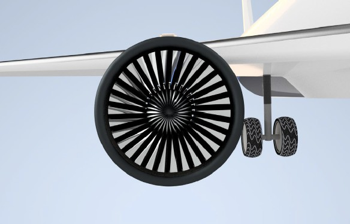
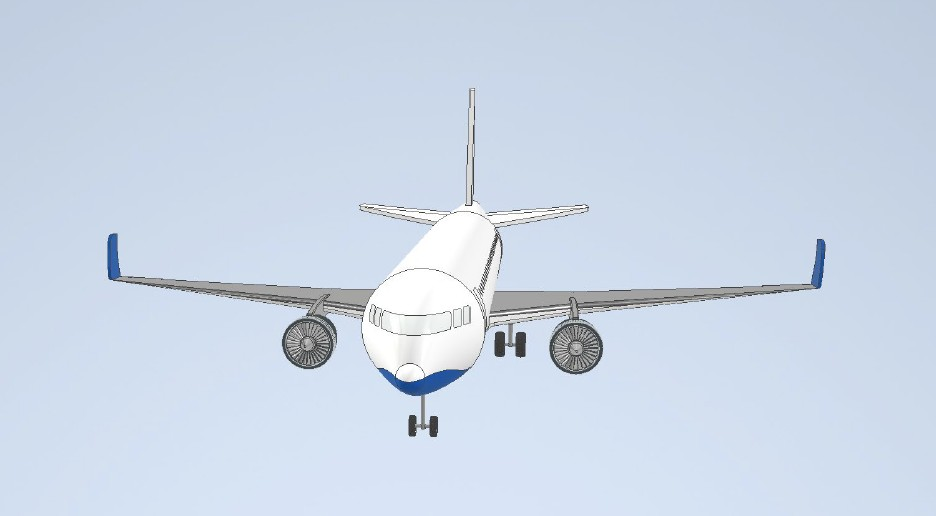
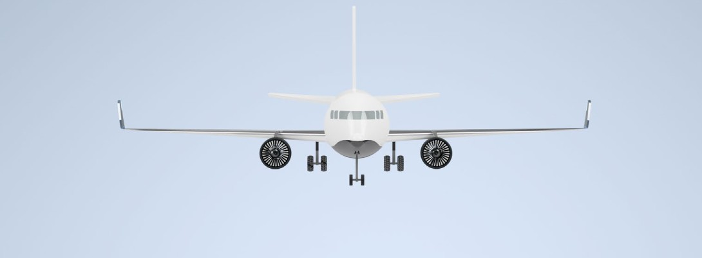
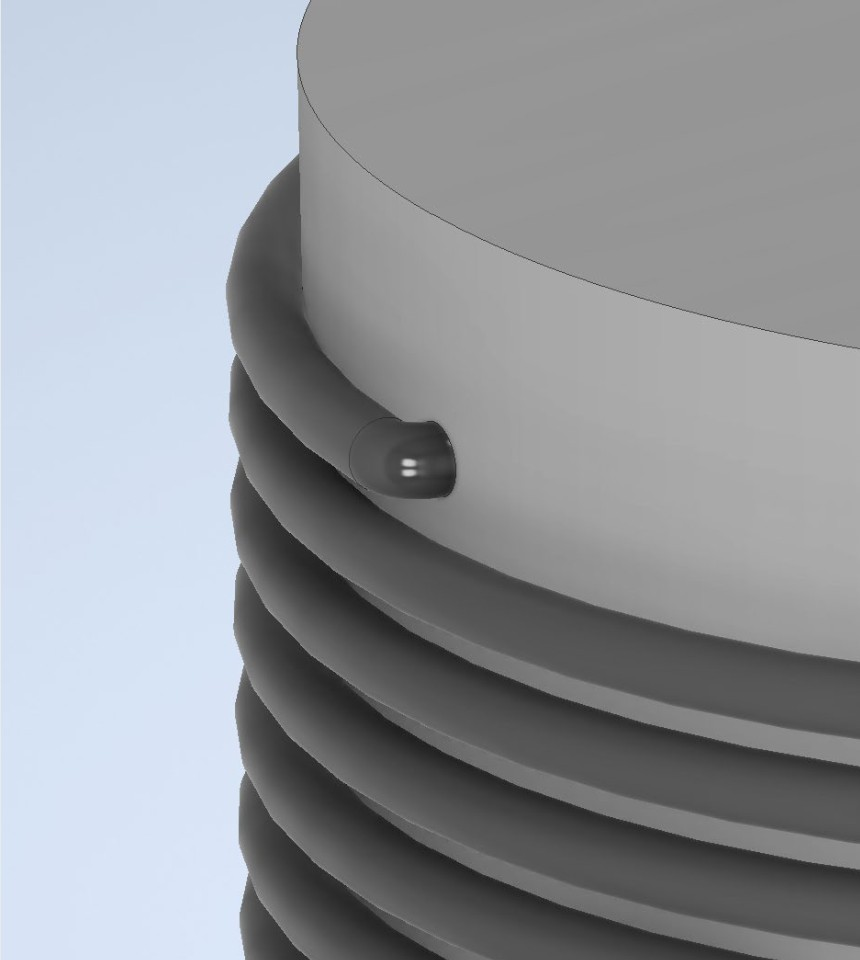
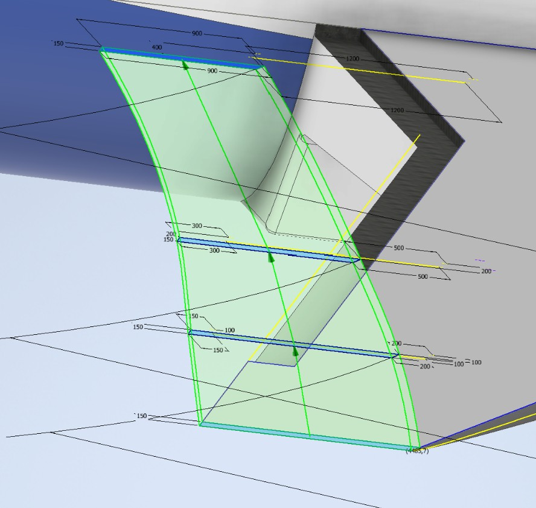
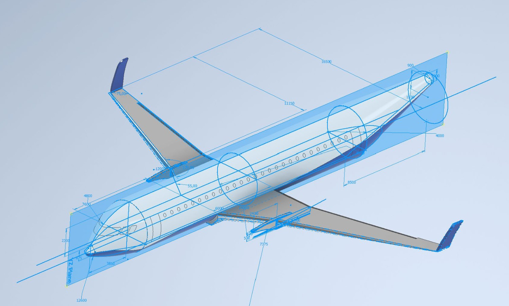
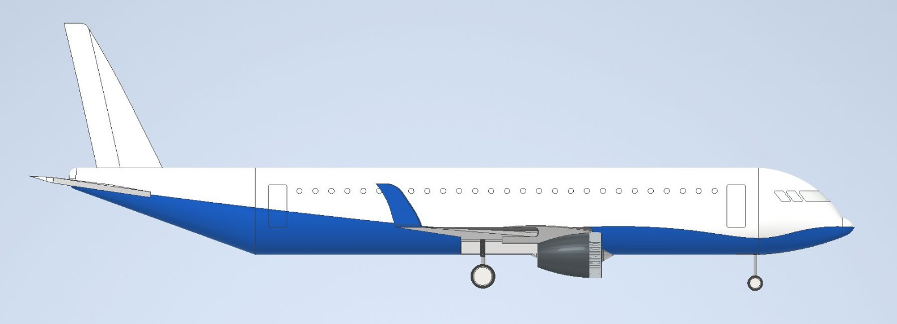
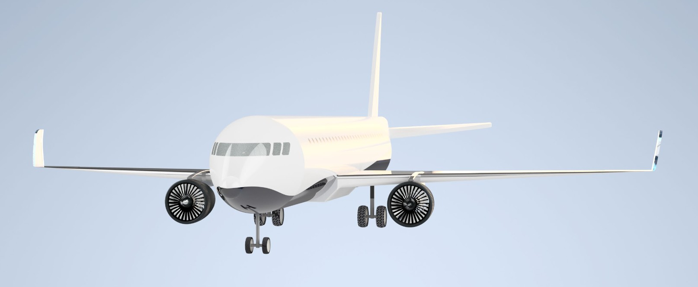

# CAD-Projekt---Boeing-737-800
Projektet syftade till att återskapa ett flygplan av typen Boeing 737-800 i Autodesk Inventor. 

<!-- Första bilden  -->

  

<!-- Collage med resterande bilder -->
<table>
  <tr>
    <td></td>
    <td></td>
    <td></td>
  </tr>
  <tr>
    <td></td>
    <td></td>
    <td></td>
  </tr>
  <tr>
    <td></td>
    <td></td>
    <td></td>
  </tr>
  <tr>
    <td colspan="3"></td>
  </tr>
</table>
